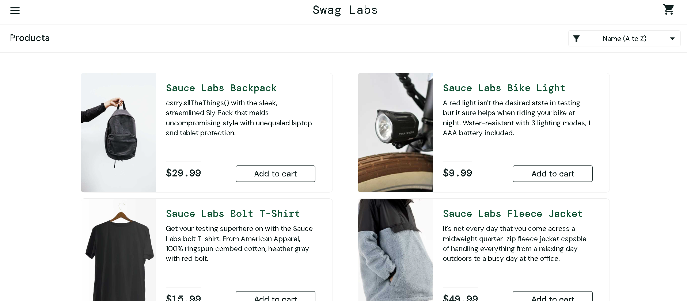

# 📌 Project-2: Manual Testing of SauceDemo E-Commerce Workflow
Welcome to my **Intermediate Manual Testing Project 🚀**. 
In this project, I performed **end-to-end manual testing** on the **SauceDemo E-commerce Application**.
The objective of this project is to simulate a **real QA testing process using the STLC (Software Testing Life Cycle)**. 
From **Day-1 to Day-6**, I created all testing deliverables step-by-step, just like a real QA team working on a sprint.

The workflow tested in this project:
**Login → Product Listing → Add to Cart → Checkout → Order Completion**

---

# 🌐 Application Under Test (AUT)
🔗 https://www.saucedemo.com/

**SauceDemo** is a demo **E-commerce web application** widely used for practicing **manual and automation testing**.

---

# 🛠️ Tools Used
**Excel / Google Sheets**
→ Test Scenarios
→ Test Cases
→ Test Execution Sheet

**Jira**
→ Defect / Bug Report

**MS Word / Google Docs**
→ Software Requirements Specification (SRS)
→ Test Plan
→ Test Summary Report

**GitHub**
→ Version Control
→ Project Documentation

---

# 📂 STLC Based Project Deliverables
This project follows the **Software Testing Life Cycle (STLC)** and each phase deliverable is documented.

### 📅 Day-1 — Requirement Analysis
* Understanding the application workflow
* Identifying functional & non-functional requirements
* Preparing **Software Requirements Specification (SRS)**

### 📅 Day-2 — Test Planning
* Scope & Objectives
* Testing strategy
* Entry & Exit criteria
* Risk analysis
* Deliverable: **Test Plan Document**

### 📅 Day-3 — Test Scenario Design
* Creating **82 high-level Test Scenarios**
* Covering complete E-commerce workflow across 6 modules

### 📅 Day-4 — Test Case Design
* Writing **107 detailed Test Cases**
* Including:
  * Preconditions
  * Test Steps
  * Expected Results
  * Test Data

### 📅 Day-5 — Test Execution & Defect Reporting
* Executing all **107 test cases**
* Logging **Pass / Fail results**
* **4 defects** reported in Jira with:
  * Severity & Priority
  * Steps to Reproduce
  * Actual vs Expected Result

### 📅 Day-6 — Test Closure
* Preparing **Test Summary Report (TSR)**
* Overall testing status & metrics
* Defect analysis
* Tester observations & recommendations

---

# 🔎 Testing Workflow Covered
This project tests the **complete user purchase flow**:

1️⃣ User Login 
2️⃣ Product Listing Page 
3️⃣ Add Product to Cart 
4️⃣ Cart Verification 
5️⃣ Checkout Process 
6️⃣ Order Confirmation

---

# 📊 Test Execution Summary

| Module                        | Total TCs | Passed | Failed | Not Executed |
| ----------------------------- | --------- | ------ | ------ | ------------ |
| Login                         | 15        | 15     | 0      | 0            |
| Product Listing               | 18        | 14     | 4      | 0            |
| Cart                          | 18        | 18     | 0      | 0            |
| Checkout – Your Information   | 20        | 20     | 0      | 0            |
| Checkout – Overview           | 23        | 23     | 0      | 0            |
| Checkout – Complete           | 14        | 14     | 0      | 0            |
| **TOTAL**                     | **108**   | **104**| **4**  | **0**        |

> ✅ Overall Pass Rate: **96.29%**

---

# 🐛 Defects Logged

| Bug ID | Module  | Description                                          | Severity | Priority | Status |
| ------ | ------- | ---------------------------------------------------- | -------- | -------- | ------ |
| BUG-01 | Product | Incorrect product name displayed for Product #6      | High     | High     | Open   |
| BUG-02 | Product | Incorrect product description displayed for Product #1 | Medium | Medium   | Open   |
| BUG-03 | Product | Terms of Service footer link is not clickable        | Low      | Low      | Open   |
| BUG-04 | Product | Privacy Policy footer link is not clickable          | Low      | Low      | Open   |

---

# 🔍 Tester Observations

Beyond standard pass/fail results, the following behavioral issues were observed during exploratory testing:

**OBS-01 — No Field-Level Input Validation**
> Both the Login page and Checkout – Your Information page only show a generic banner-style error on invalid/empty input. There is no inline per-field validation to guide the user about which specific field has an issue.

**OBS-02 — Broken Page for Invalid Product URL**
> Navigating to `https://www.saucedemo.com/inventory-item.html?id=77` (or any ID beyond 0–5) shows a broken "Item Not Found" page with a dog image and random text — indicating missing URL parameter validation.

**OBS-03 — Empty Cart Checkout Allowed**
> The system allows users to complete the full checkout flow and place an order even when the cart is completely empty — a business logic defect that should be restricted.

---

# 📊 Sample Test Case

| Test Case ID | Description                                  | Steps                                          | Expected Result                            | Status |
| ------------ | -------------------------------------------- | ---------------------------------------------- | ------------------------------------------ | ------ |
| TC_LOGIN_01  | Verify user can login with valid credentials | Enter valid username & password → Click Login  | User should be redirected to Products page | Pass   |

---

# 🎯 Key Learning Outcomes
✔ Understanding **end-to-end STLC process** 
✔ Writing professional **Test Plan & SRS Document** 
✔ Designing structured **Test Scenarios & Test Cases** 
✔ Performing **Test Execution & Defect Reporting** via Jira 
✔ Creating **Test Summary Report** like real QA projects 
✔ Identifying **business logic & UX issues** through exploratory testing 
✔ Hands-on testing of a complete **E-commerce workflow**

---

# 📌 Project Status
✅ **Completed (Intermediate Level Project)** 
All STLC deliverables have been created and documented Day-wise.

---

# 👨‍💻 Author
**Adarsh Jayprakash Mishra** 
🎓 B.Sc. Computer Science 
💻 Aspiring **QA Automation Tester**
